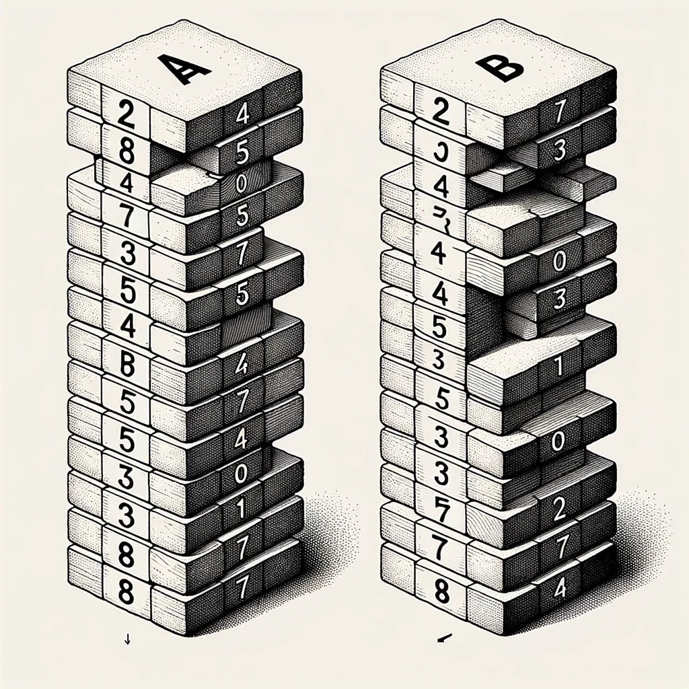

<center><h1><b><span style="color: yellow;">Push_swap</span></b></h1></center>

<center><b><span style="color: white;">Introduction</span></b></center>


<center>Push Swap is a project from the 42 school curriculum focused on sorting numbers using two stacks, aiming to minimize the number of operations required. The program manipulates two stacks, namely Stack A and Stack B, and applies a series of predefined operations to reorder the elements.</center>


<p align="center">
  
</p>


## Operations
The following operations are available:

Operation | Description |

- `pa` : Take the first element at the top of stack B and put it at the top of A. (do nothing if empty)
- `pb` : Take the first element at the top of stack A and put it at the top of B.
- `sa` : Swap the first 2 elements at the top of stack A.
- `sb` : Swap the first 2 elements at the top of stack B.
- `ss` : sa + sb at the same time
- `ra` : (rotate a): Shift up all elements of stack A by 1.
- `rb` : (rotate a): Shift up all elements of stack B by 1.
- `rr` : ra and rb at the same time.
- `rra` : a (reverse rotate a): Shift down all elements of stack A by 1. The last element becomes the first one.
- `rrb` : (reverse rotate b): Shift down all elements of stack B by 1. The last element becomes the first one.
- `rrr` : rra and rrb at the same time.


The main goal was to create a program that will sort stack A in the less amount of instructions. for 100 random numbers, this program should have less than 700 instructions.

# Bonus: Checker Program
The Push Swap project includes a bonus component called the Checker program. This program allows users to input a series of commands to manipulate an unsorted stack and verify whether the correct operations have been applied to sort the stack. This interactive tool provides a practical way to test and verify the functionality of the sorting algorithm implemented in Push Swap.

## Table of Contents

- [Installation](#installation)
- [Usage](#usage)

## Installation

To use push_swap, navigate to your terminal and enter the main folder. Then, execute the following command:

```bash
make
```

To utilize the bonus part, execute the following command:

```bash
make bonus
```

You can also test for memory leaks using your own arguments or the default ones by running:

```bash
make leak
```
The project's Makefile automatically configures the memory leak detection tool based on the operating system:

<b>- Linux:</b> By default, the tool is set to valgrind.

<b>- Mac:</b>  The tool is set to leaks with the --atexit option.
## Usage

The program supports both Linux and macOS.

To execute the program, run the following command in your terminal (those numbers are only for demonstration):

```bash
./push_swap 3 -400 22 50 1 -302 43
```
If you input a pre-sorted list of numbers, as well as if the list of number has dubles of the same number in it, the program should not display any output.
the list of number should consiste only argument of type int.
after launching the program, a list of instruction will apear, that will sort this stack.

to use the checker program:

```bash
./checker 3 -400 22 50 1 -302 43
```

Provide the program `./checker` with a list of integers of your choice. than, run the
than enter the commands one by one following a new line (`pa\n ra\n pb\n `) for example, and to finish hit `ctrl + d`.

